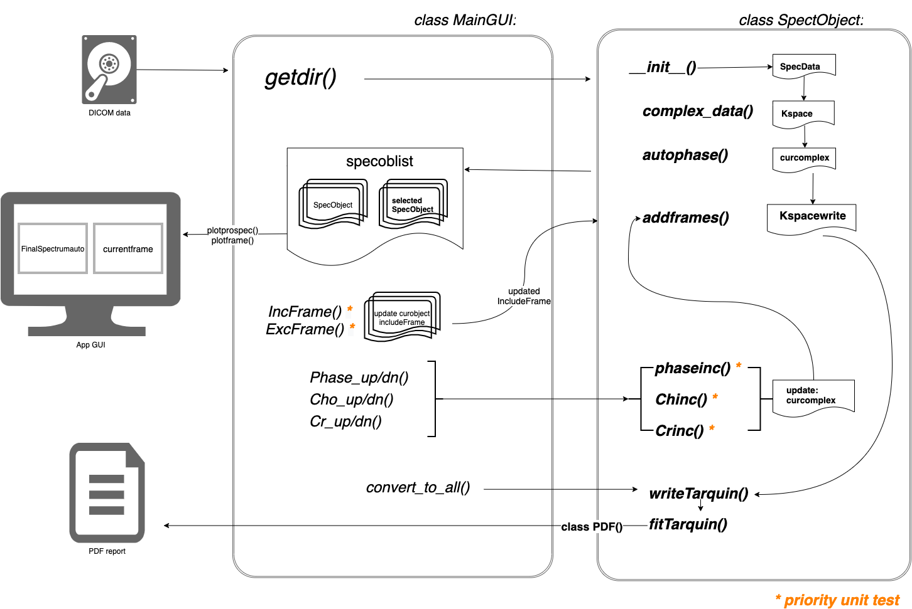

# Main script:  MRS_Convert.py

Version 1.4
Modified 21/02/2020

Python3 version of the script. 
Imported from: Version 1.3.1

Created on 11 Dic 2019
@author: Patxi Torrealdea

...  

Version 1.3.1
Modified 28/07/2017

Script to convert Philips MRS data to Tarquin format for spectral processing
This script will deal with data acquired with multiple dynamic acquisitions
and saved in DICOM4 format. Phasing and peak picking is done automatically but
can be adjusted manually.

Created on Thu Oct 2015
@author: Alan Bainbridge

# Script data-flow diagram:

 

The diagram shows the overview data-flow produced by the NeonateMRS-UCLH script; starting from the DICOM files to the generation of the PDF report.
The *Class definitions* section below provides specific information on each component.  

# Class definitions:

## Maingui(object):
The class *Maingui()* builds the main Graphical User Interface (GUI) using QMainWindow class' functions of QtGui.   
Creates the main application window and provides it with the functionality to open, preprocess and display NMR spectroscopy stored in DICOM4 format. 

Parameters:   
It takes a QtGui.QMainWindow class object. (Refer to Qt modules' documentation on QMainWindow)
  
>### Methods in Maingui() class:
___
### **_ init _(self)**: 
Constructor for Maingui class that initialises required parameters and calls method **initUI()**.

Parameters of **_ init _():**   
<pre>
specoblist: Holds a list of NMR spectrum objects (we'll refer to them as <i>SpecObjects</i>) generated by <b>SpecObject()</b> class.

curobject: Index of current instance of <b>SpecObject()</b>. Initialises as 0 (for the 1st spectroscopy object) and increases or decreases by 1 when <b>specup()</b> or <b>specdown()</b> is called, respectively.
  
setsavedir: Flag that indicates whether the 'save' directory has been set or not (1:Yes, 0:No).

version: Current version of the script ('1.4') that will be written to the logfile.
</pre>

Method **initUI()** is called by **_ init _()**.

___
### **initUI(self)**:
**initUI(self)** defines the elements of the main GUI using the functionality of *pyqtgraph* and *QtGui* classes. Important methods used are **PlotWidget(self)** in *pyqtgraph* and **QMessageBox()**, **QPushButton()** in *QtGui* which do the following:  
  * Plot the NMR data as a graph in different windows (left window for the summed data, right window for the individual frame data). 
  * Define the geometry of the displayed windows. 
  * Add the menu-bar with its corresponding message dialogs.
  * Define the buttons and associate them to their corresponding trigger functions.
  
Important parameters defined by **_ init _():** 
<pre>
plotwidget: left plot window (generated by <b>PlotWidget()</b> class in <b>pyqtgraph</b>) that will be used to display the summed spectra.

plotwidget.p1: place holder for x and y axis data that will be used to display the summed spectra by methods <b>plotorigspec()</b>  and <b>plotprocspec</b>.

plotwidget.p2: Left marker representing the lower frequency limit for the phasing range of <b>autophase()</b>. 

plotwidget.p3: Right marker representing the higher frequency limit for the phasing range of <b>autophase()</b>. 

plotwidget2: right plot window (generated by <b>PlotWidget()</b> class in <b>pyqtgraph()</b> that will be used to display the spectra from individual frames.

plotwidget2.p21: place holder for x and y axis data that will be used to display the current frame spectra by <b>plotframe()</b>

plotwidget2.p22: Marker representing the position of the Cho resonance frequency determined by <b>autophase()</b> or manually by methods <b>Cho_up()</b> and <b>Cho_down()</b>. 

plotwidget2.p23: Marker representing the position of the Cr resonance frequency determined by <b>autophase()</b> or manually by methods <b>Cr_up()</b> and <b>Cr_down()</b>. 
</pre>
  
___
### **about(self)**:  
Displays the script information text defined in **initUI()**. 
It calls **show()** of **QMessageBox()** to display the text in a message box.

___
### **dcmmssg(self)**:  
Displays information text about how DICOM formats are treated, defined in **initUI()**. 
It calls **show()** of **QMessageBox()** to display the text in a message box.

___
### **getdir(self)**: 
Selection and identification of correct DICOM data to be preprocessed.  

The **getdir()** method opens a *QFileDialog* (from *QtGui*) for the user to choose the folder in which the MRS data will be searched.
It recursively checks every file in the selected folder looking for a valid dataset (DICOM 4 MRS data). If a valid dataset is found a *SpecObject* object is created using **SpecObject()** method and is appended to the *specoblist*.  

Parameters of **getdir():**
<pre>
specoblist: Holds a list of NMR spectrum objects (we'll refer to them as <i>SpecObjects</i>) generated by <b>SpecObject()</b> class. 

curobject: Index of current instance of <b>SpecObject()</b>. Initialises as 0 (for the 1st spectroscopy object) and increases or decreases by 1 when <b>specup()</b> or <b>specdown()</b> is called, respectively. (See methods of class <b>SpecObject()</b>).

dirname: Path to the directory where MRS data files will be searched.

</pre>

When valid NMR data are found, **getdir(self)** calls methods **plotorigspec()** and **plotframe()** to plot both the summed original (unprocessed) data and the current single-frame spectra. 

___
### **plotorigspec(self)**:
Method to plot the summed of all the original (unprocessed) frames stored in *SpecObject.OriginalSpectrum*. 
The variable *p1* gets updated with data in *OriginalSpectrum*.
(See method **create_original()** of **SpecObject()** class).

___
### **plotprocspec(self)**:  
Method to plot the summed of all the processed frames stored in *SpecObject.FinalSpectrumauto*.
The variable *p1* gets updated with data in *FinalSpectrumauto*.
(See methods **autophase()** and **addframes()** in class **SpecObject()**).

___
### **Phasereg(self)**:  
The **Phasereg()** method allows the user to modify the range in which autophase will be applied, as well as the apodisation constant used.  
It overwrites the default values of *plim_l* (default 1110), *right_int* (default 1140) and *adop_const* (default 128) with user input.

The method makes use of the **PhaseDialog()** class to define the GUI where input values are entered.

___
### **savedir(self)**:  
Method to allow the user select the directory where the output of the script will be saved. It uses **getExistingDirectory()** in *QtGui.QFileDialog* class to show and navigate from the directory structure.
___
### **specup(self)**: 
Method **specup()** selects the next available NMR spectroscopy dataset found by **getdir()**.  
If the value of *curobject* is smaller than the number of the NMR spectra in *specoblist*, **specup()** increases value of *curobject* by 1.  
Lastly, method **plotorigspec()** is called to plot the original summed spectrum of the updated dataset.
    

___
### **specdown(self)**:  
Method **specup()** selects the previous available NMR spectroscopy dataset found by **getdir()**. If the value of *curobject* > 0 (not the 1st available dataset), **specup()** reduces value of *curobject* by 1.  
Lastly, method **plotorigspec()** is called to plot the original summed spectrum of the updated dataset.

___
### **jmrui(self)**:  
Method **jmrui()** triggers the process of saving the jMRUI readable textfile required for the NMR spectrum analysis in jMRUI.  
If the output directory is not already set, **savedir()** method is called before **writejmruidata2()**. See the description of both methods below.

___
### **Tarquin(self)**:  
Method **Tarquin()** triggers the process of generating the DICOM file required as the input for the spectroscopy analysis in Tarquin.   
If the output directory is not already set, **savedir()** method is called before **writeTarquin()**. See the description of both methods below.
 

___
### **Tarquinorig(self)**:   
Method **Tarquin()** triggers the process of generating the unprocessed DICOM file (summed frames with their original phase and frequency) as the input for the spectroscopy analysis in Tarquin. If the output directory is not already set, **savedir()** method is called before **writeTarquinorig()**.  
See the description of methods **savedir()** and **writeTarquinorig()** in **SpecObject()** class.

___
### **convert_to_all(self)**:  
Method **convert_to_all()** triggers a number of processes which include: 
* saving the DICOM and text files of both the processed and unprocessed data to be analysed by jMRUI and Tarquin
* saving the logfile with the parameters used for the processing of the spectra
* calling **fitTarquin()** method to initiate the spectral fitting in Tarquin and the generation of the final PDF report. 
   
If the output directory is not already set, **savedir()** method is called before **writejmruidata2orig()**, **writeTarquinorig()**, **writejmruidata2()**, **writeTarquin()**, **writelogfile()** and **fitTarquin()** are called.  
See the description of all methods in **SpecObject()** class.

 

___
### **frameup(self)**:  
Method that selects the *next* available NMR spectrum frame in the dataset. See **frameup()** of SpecObject() class below. 
Once the frame is updated, **plotframe()** method is called to plot the new *current frame* spectrum.

___
### **framedown(self)**:  
Method that selects the *previous* available NMR spectrum frame in the dataset. See **framedown()** of SpecObject() class below. 
Once the frame is updated, **plotframe()** method is called to plot the new *current frame* spectrum.

___
### **plotframe(self)**:     
Method **plotframe()** is responsible for plotting the *current frame* spectrum (real part) stored as *curobject.current_frame* of the current *specoblist*.  
It updates the *y* values of the spectrum and peak position for the current frame (parameters *p21*, *p23* and *p23* of plotwidget2) and displays a text massage to inform whether the *current frame* is included (*IncludeFrame*=1) or excluded (*IncludeFrame*=0) in the final summed spectrum based on the *IncludeFrame* flag value.

___
### **undophase(self)**:     
The method calls **undophase()** of **SpectObject()** class to resets all the applied phase shifts and restore the original phase as read from the DICOM file. (See **undophase()** in **SpectObject()** class).  
Additionally, it calls **plotframe()** and **plotprocspec()** to update the plots of the current frame and the summed spectra.  

### **undoshift(self):**     
The method calls **undoshift()** of **SpectObject()** class to resets all the applied 'frequency' shifts and restore the default values of the positions for the Ch and Cr resonance peaks. (See **undoshift()** in **SpectObject()** class).  
Additionally, it calls **plotframe()** and **plotprocspec()** to update the plots of the current frame and the summed spectra.  

___
### **IncFrame(self)**:     
Method  **IncFrame()** sets the value of *IncludeFrame* flag in the current frame (*curframe*) equals to 1. The *current frame* spectrum will be included in the final summed spectrum.   
See method **addframe()** of **SpectObject()** class.

___
### **ExcFrame(self)**:    
Method  **ExcFrame()** sets the value of *IncludeFrame* flag in the current frame (*curframe*) equals to 0. The *current frame* spectrum will be excluded from the final summed spectrum.  
See method **addframe()** of **SpectObject()** class.

___
### **Phase_up(self)**:    
**Phase_up()** applies a 5 degree phase increment to the *current frame* spectrum by calling **phaseinc(increment)** method in **SpectObject()** with *increment* value 5. (See method **Phase_up()** of **SpectObject()** class).  
It then calls **plotframe()** and **plotprocspec()** to update the plots of the current frame and the summed spectra.  

### **Phase_dn(self)**:  
**Phase_dn()** applies a 5 degree phase reduction to the *current frame* spectrum by calling **phaseinc(increment)** method in **SpectObject()** with *increment* value -5. (See method **Phase_up()** of **SpectObject()** class).  
It then calls **plotframe()** and **plotprocspec()** to update the plot of the current frame and the summed spectra.  

___
### **Cho_up(self)**:  
**Cho_up()** shifts the position of the current frame's Cho resonance peak of by calling **Choinc(increment)** in class **SpectObject()** with *increment* value 1. This applies a one steps increase (corresponding to +1.95 Hz in our current protocol) to the centre position of the Cho resonance, stored in parameter *peakposarr[0]*. (See method **Choinc()** of **SpectObject()** class).  
It then calls **plotframe()** and **plotprocspec()** to update the plot of the current frame and the summed spectra.  

___
### **Cho_dn(self)**:  
**Cho_dn()** shifts the position of the current frame's Choline resonance peak of by calling **Choinc(increment)** in class **SpectObject()** with *increment* value -1. This applies a one steps reduction (corresponding to -1.95 Hz in our current protocol) to the centre position of the Cho resonance, stored in parameter *peakposarr[0]*. (See method **Choinc()** of **SpectObject()** class).  
It then calls **plotframe()** and **plotprocspec()** to update the plot of the current frame and the summed spectra.  

___
### **Cr_up(self)**:  
*Same as **Cho_up()** for the Creatine peak*.  
**Cr_up()** shifts the position of the current frame's Creatine resonance peak of by calling **Crinc(increment)** in class **SpectObject()** with *increment* value 1. This applies a one steps increase (corresponding to +1.95 Hz in our current protocol) to the centre position of the Cr resonance, stored in parameter *peakposarr[1]*. (See method **Crinc()** of **SpectObject()** class).  
It then calls **plotframe()** and **plotprocspec()** to update the plot of the current frame and the summed spectra.  

___
### **Cr_dn(self)**: 
*Same as **Cho_dn()** for the Creatine peak*.  
**Cr_dn()** shifts the position of the current frame's Creatine resonance peak of by calling **Crinc(increment)** in class **SpectObject()** with *increment* value -1. This applies a one steps reduction (corresponding to -1.95 Hz in our current protocol) to the centre position of the Cr resonance, stored in parameter *peakposarr[1]*. (See method **Crinc()** of **SpectObject()** class).  
It then calls **plotframe()** and **plotprocspec()** to update the plot of the current frame and the summed spectra.  

___
### **PhaseDialog(QtGui.QDialog)**:  
PhaseDialog() class defines and creates the dialogs to be used by **Phasereg()** method. Specifically, it defines the layout, connections and labels for the 'Right limit', 'Left limit' and 'Apodisation' buttons various inbuilt class in QtGui.

#
#
#
# Supporting module: Spec_Module.py
The Spec_Module.py module is imported at the beginning of the main **MRS_convert.py** script and contains *classes* that are necessary for the execution of the code. 
The function of each *class* is described below.

## Classes in Spec_Module.py: 

## SpecObject(object):  
>### Methods in SpecObject() Class:
___
### **_ init _(self):** 
The **_ init _**  method in the SpecObject class initiates the core functionality of the NeonateMRS script.  

Through a series of steps described below, the *_ init _* method handles the identification and loading of the MRS DICOM data, computes the FFT, phase and frequency corrects each of the NMR frames before adding them together into the final spectrum that will be processed in Tarquin. 

The  phase and frequency shifts are automatically corrected based on the Cho and Chr resonances. (Note: As described above, the GUI provides the user control to adjust and override the automated corrections as well as to exclude from the summation any NMR frame that may be of lower quality than the average). 

Arguments for **_ init _(self, filename, dirpass)**:  
<pre> filename: name of the file to check for DICOM format data. 

dirpass: name of the folder containing filename.
</pre> 

Parameters of **_ init _(self)**:  
<pre>NumSpecObjects: Stores the number of valid NMR spectra datasets in the dirpass folder. It's value increases by 1 when <b>__init__()</b> is called but reduces also by 1 when filename is not a valid spectroscopy dataset.
    
spectypes: Describes types of dataset. 
    0 : Not a spectroscopy dataset
    1 : Classic spectroscopy dataset 
    2 : Enhanced spectroscopy dataset
    3 : Siemens IMA file
    4 : RDA file"

Notes that currently only Spectype 2 (Philips Enhanced DICOM) datasets are supported by the <b>__init__()</b> function.  Datsets of other types will fail to load.

mruiload: 0. (Currently unused).
    
plim_l: initial left limit from which the automated phase shift is calculated.
    
plim_r: initil right limit from which the automated phase shift is calculated.
    
adop_const: 128.0. Apodisation constant. (Currently unused).
    
ds: Place holder for the DICOM object outputted by dcm.read_file(). It remains empty until filename is successfully red by the DICOM reader.
    
</pre>

When data is of type 2 (Philips Enhanced DICOM) the following parameters are generated: 

<pre>PatientName: Patient name extracted from the DICOM header. (Currently unused).
    
StudyDate: Study date extracted from the DICOM header. (Currently unused).
    
StudyTime: Study time extracted from the DICOM header. (Currently unused).
    
SeriesDate: Series date extracted from the DICOM header. (Currently unused).
    
SeriesTime: Series time extracted from the DICOM header. (Currently unused).
    
SpecData: The actual NMR data extracted from the DICOM file. For the Philips Enhanced DICOM MRS format, the data is arranged in a single array of paired values (Real and Imaginary channels), starting with the non-water-suppressed data ie. [RE, IM, RE, IM... REws, IMws, REws, IMws].
    
Datapoints: Number of complex data point per frame extracted from the DICOM header.
    
SpectralWidth: Spectral Width of the acquired spectrum from the DICOM header. (For jMRUI. Currently unused).
    
TransmitterFrequency: Transmitter frequency of the acquired spectrum from the DICOM header. (For jMRUI. Currently unused).
   
FieldStrength: 3. Field strength of the scanner in which data is acquired [T]. (For jMRUI. Currently unused).
    
PatID: Patient ID extracted from the DiCOM header to include in the final MRS report. 
    
AcquisitionDateTime: Date of acquisition from DICOM header. (For jMRUI. Currently unused).
    
ProtocolName: Protocol Name from DICOM header. (For jMRUI. Currently unused). 
    
Frames:  Number of frames stored in filename. (For the proscribed acquisition protocol there are 32 of frames per acquisition, corresponding to 16 non-water-suppressed and 16 water-suppressed NMR spectra).
    
displayTE: Echo time of the acquisition stored in DICOM header to display in the final report (For the proscribed acquisition protocol TE = 288 ms so that the resonances of Lactate and NAA are in-phase).
    
curframe: Keeps track of the current NMR frame being operated. It takes value 0 with, <b>_ init _()</b> and increases or decreases by 1 when <b>frameup()</b> or <b>framedown()</b> methods are called, respectively.
</pre>                       
The final action of **_ init _()** is to call the **complex_data()** method.  

___
### **complex_data(self)**:  
The method *complex_data()* forms the complex k-space (time domain) data and it's FFT complex spectra and arranges them in a series of **Frames**/2  arrays (Frames/2 because it only take the water suppressed data) with **Datapoints** complex points per frame from data stored in **SpecData** of the instance of type SpectObject.  

Once the data is arranged in the array, it applies an apodisation function (a mono-exponential decay to the 2nd half of the spectra) to generate to parallel sets of spectra; apodised and non-apodised.

The apodised spectra is used to improve the results of the auto phase and frequency shift algorithms. Only the corrected non-apodised spectra is fitted in Tarquin.  
*Known issues: The apodisation functionality is currently not working and so this functionality is not used in the current implementation*

Parameters of **complex_data()**:  
<pre>
Kspace: Placeholder to store raw K-space of an individual frame.

Kspacewrite: Placeholder to store the summed K-space data from all frames with IncludeFrame=1.
    
Kspaceadop: Placeholder for the adopised K-space of individual frames.
    
Spectrum: Placeholder for the raw spectrum (FFT of K-space) for an  individual frame. 
    
Spectrumadop: Placeholder for the apodised spectrum (FFT of K-space) for an individual frame. 
    
IncludeFrame: Flag to include (1) or exclude (0) the current frame in the summation to generate the summed k-space and spectra.
</pre>        

When the data are stored into the appropriate parameters **complex_data()** calls **self.create_original()** and **self.autophase()** methods to start the summation of the uncorrected (original) spectra and to perform auto-corrections, respectively.   

___
### **create_original(self)**:  
**create_original()** adds together the individual frames to yield original (uncorrected) summed datasets.  

Parameters of **create_original()**:  
<pre>
OriginalKspace: Stores the summed Kspace data of all the frames without correction and regardless of the IncludeFrame flag value.

OriginalSpectrum: Stores the summed spectrum data of all the frames without correction and regardless of the IncludeFrame flag value. 
</pre>     

___
### **autophase(self)**:  
The **autophase()** method performs two main functions: 1) it finds the optimum phase required to shift each individual spectrum into pure *absorption mode* and 2) finds the centre frequency of Cho and Cr resonances to be able to perform a frequency correction of the NMR frames. 

Parameters of **autophase()**:
<pre>FinalKspaceauto: Data array to store the final corrected k-space as the sum of frames with IncludeFrame flag value 1. <i>(Redefined in <b>addframes()</b> Unused here)</i>
     
FinalSpectrumauto:  Data array to store the final corrected spectrum as the sum of frames with IncludeFrame flag value 1. <i>(Redefined in <b>addframes()</b>. Unused here)</i>
     
Spectrumauto: Data array to store the corrected non-apodised spectrum.  (Not used)
        
Spectrumautoadop: Data array to store the corrected apodised spectrum. (Not used)

optphasearr:  Stores optimum phasing angle for each frame. 
        
peakposarr: Stores of the position of resonance peaks (Cho and Cr) for each frame in a list. Values in <i>peakposarr</i> will be used in <b>addframe()</b>, <b>Choinc()</b>, <b>Crinc()</b> and <b>writelogfile()</b> methods. If the algorithm fails to identify the location of the peaks, it stores the default values (1120 & 1130) into <i>peakposarr</i>.
        
shiftarr: (Not used).
        
shiftindex: Stores the average value found for the array position of the Ch and Cr peaks in a list.  <i>(Redefined in <b>addframes()</b>. Unused here)</i>i>
        
curcomplex: Stores the non-apodised spectrum of the current frame with optimum phase shift found (or overwritten the by user).
        
acurcomplex: Stores the apodised spectrum of the current frame with optimum phase shift found (or overwritten by the user).
        
med: Array with <i>shiftindex</i> values from which to calculate median-shift of all of the frames. <i>(Redefined in <b>addframes()</b>. Unused here)</i>
</pre>

**autophase()** calls the *addframes()* method that handles the summation of the processed frames.

___
### **addframes(self)**:  
Method **addframes()** performs the 'frequency' shift of each frame and stores them in Kspacewrite parameter. 
The actual shift applied is calculated as the *median-shift of all frames - shiftindex of the current frame*.   
Frames with value of flag *IncludeFrame* set to 0 are substitited by arrays of zeros so that they do not contribute to the final summed spectra.   

Parameters of **addframes()**:
<pre>
FinalKspaceauto: Data array to store the final corrected k-space as the sum of frames with </i>IncludeFrame<i> flag value 1.
   
FinalSpectrumauto: Data array to store the final corrected spectrum as the sum of frames with <i>IncludeFrame</i> flag value 1. 
        
shiftindex: Stores the average value found for the array position of the Ch and Cr peaks for each frame in a list. It will to be used in <b>addframe()</b>.

Kspacewrite: Data array containing the corrected k-space (for frames with <i>IncludeFrame</i> = 1) and array of zeros (for frames with <i>IncludeFrame</i> = 0). It will be used in <b>writeTarquin()</b>.

med: Array with <i>shiftindex</i> values from which to calculate median-shift of all of the frames.
</pre>        
The method **set_current_frame()** is called as the last action of **addframes()**.

___
### **set_current_frame(self)**:
The method **set_current_frame()** defines the *curret_frame* spectrum array which will be displayed in the GUI window.  

Parameters of **set_current_frame()**:

<pre>
curret_frame: Takes the values stored in <i>acurcomplex</i>; the spectrum in the current frame with all the applied corrections.  
</pre>

___
### **phaseinc(self, increment)**: 
**phaseinc()** allow the user to apply a phase shift to the current frame data of *increment* degrees. It overwrites the automated phase value found in **autophase()**.

Arguments for **phaseinc(self, increment)**:
<pre>
increment: the number of degrees by which the <i>curret_frame</i> spectrum will be shifted (acurcomplex & curcomplex)
</pre>       
Once the the phase shift is applied **phaseinc()** calls **addframes()** and **set_current_frame()** to compute the summation of the frames and to update the *curret_frame* spectrum.

___
### **Choinc(self, increment)**:
**Choinc()** allows the user to specify the position of the Cho resonance peak of the current frame.  The input value *increment* represents the shift (as steps in the spectrum array) by which the centre peak position of Cho will be updated. It overwrites the automated *shiftindex* found in **autophase()**.

Arguments for **Choinc(self, increment)**:
<pre>
increment: the number of steps by which the position corresponding to the Cho resonance peak will be shifted. A number of <i>increment</i> steps will be added to value in <i>peakposarr[0]</i> of the current frame.
</pre>    
It invokes **addframes()** and **set_current_frame()** to compute the summation of the frames and to update the *curret_frame* spectrum.

___
### **Crinc(self, increment)**:  
**Crinc()** allows the user to specify the position of the Cr resonance peak of the current frame.  The input value *increment* represents the shift (as steps in the spectrum array) by which the centre peak position of Cr will be updated. It overwrites the automated *shiftindex* found in **autophase()**.

Arguments for **Crinc(self, increment)**:

<pre>
increment: the number of steps which the Cr resonance peak will be shifted. A number of </i>increment<i> steps will be added to value in <i>peakposarr[1]</i> of the current frame.
</pre>    
It invokes **addframes()** and **set_current_frame()** to compute the summation of the frames and to update the *curret_frame* spectrum.

___
### **framedown()**:  
**framedown()** makes the *previous* NMR frame the active current-frame. It subtracts 1 to the current-frame index stored in *curframe*. If the current frame is the first one (curframe=0), **framedown()** does nothing.

___
### **frameup()**:  
**frameup()** makes the *next* NMR frame the active current-frame. It adds 1 to the current-frame index stored in *curframe*. If the current frame is the last one (curframe= 0.5xFrames-1), **frameup()** does nothing.  

___
### **undophase()**:
The **undophase()** method resets all the applied phase shifts to restore the original spectra as read from the DICOM file.
It substitutes *curcomplex* with the unaltered data stores in *Spectrum* (*acurcomplex* with *Spectrumadop* for the apodised data) and sets the optimum phase values *optphasearr* found by **autophase()** to 0.

It invokes **addframes()** and **set_current_frame()** to compute the summation of the frames and to update the *curret_frame* spectrum.  

___
### **undoshift()**:  
The **undoshift()** method resets all the applied 'frequency' shifts to restore the original spectra as read from the DICOM file. It sets the centre position values of the Ch and Cr resonance peaks *peakposarr* to 0.

It invokes **addframes()** and **set_current_frame()** to compute the summation of the frames and to update the *curret_frame* spectrum.  

___
### **writejmruidata2(self, outpath)**:  
The method **writejmruidata2()** compiles and saves the textfile required to process the corrected NMR data (*Kspacewrite*) in jMRUI. It writes the needed parameter values in a jMRUI-readable format and outputs the textfile to the directory specified by *outpath*. 

Arguments for **writejmruidata2(self, outpath)**:
<pre>
outpath: path of the directory where the output textfile will be saved.
</pre>
The textfile includes the following additional data to be interpreted by jMRUI:
<pre>
    Filename: file_path
    PointsInDataset: Datapoints
    DatasetsInFile: Frames/2
    SamplingInterval: SpectralWidth
    ZeroOrderPhase: 0E0
    BeginTime: 0E0
    TransmitterFrequency: TransmitterFrequency*1e6
    MagneticField: FieldStrength
    TypeOfNucleus: 0E0
    NameOfPatient: PatID
    DateOfExperiment: AcquisitionDateTime
    Spectrometer: Blank
    AdditionalInfo: ProtocolName           
</pre>           
*(Note: **writejmruidata2()** method works but the output file is unused; we use Tarquin)*         

___
### **writejmruidata2orig(self)**:  
Same as **writejmruidata2()** but it outputs the unprocessed summed data *Kspace* instead.  

*(Note: **writejmruidata2orig()** method works but the output file is unused; we use Tarquin)*  

___
### **writeTarquin(self, outpath)**:  
The function of <b>writeTarquin()</b> is to creates the DICOM file which will be used as the input for the spectroscopic analysis in Tarquin.    
The DICOM file is generated based on the original DICOM object stored in *ds* but where the original data has been replaced by it's corresponding, water-suppressed only, frequency and phase shifted data stored in <i>Kspacewrite</i> 
The new DICOM is saved to directory specified by <i>outpath</i>.

Arguments for **writeTarquin(self, outpath)**:
<pre>
outpath: path of the directory where the output DICOM will be saved.  
</pre>

___
### **writeTarquinorig(self, outpath)**:  
Same as **writeTarquinorig()** for the unprocessed *Kspace* data. The output of **writeTarquinorigfile()** is essentially the original DICOM file where the non-water suppressed date has been removed.

Arguments for **writeTarquinorig(self, outpath)**:
<pre>
outpath: path of the directory where the output DICOM will be saved.  
</pre>

*Note: **writeTarquinorig()** method is unused*   

___
### **writelogfile(self, outpath, version)**:  
**writelogfile()** compiles and saves a logfile with the values of the preprocessing corrections applied to each NMR frame for reproducibility and record-keeping purposes.   
It outputs the logfile to the directory specified by *outpath*. 

Arguments for **writelogfile(self, outpath, version)**:
<pre>
outpath: path of the directory where the output textfile will be saved.

version: version number of the script used.
</pre>          
The logfile stores the following information:
<pre>
Filename: file_path
Version: version       
For each frame:
    - Frame number.
    - Include: flag for included (1) or excluded (0) frame.
    - Phasing: final phase applied to the individual frame (stored in <i>optphasearr</i>)
    - Peak positions: final Cr and Cho peak positions per frame (stored in <i>peakposarr</i>)  
</pre>   

___
### **fitTarquin(self, outpath):**  
The purpose of **fitTarquin()** is three-fold. 1) It sets the appropriate parameters (inputs, outputs, basis, etc) for Tarquin to run the spectroscopy fitting, 2) it then reads the output from Tarquin and calculates the values of the metabolite ratios that will be included in the final report, and 3) formats the layout of the report with the required information and calls <b>PDF()</b> to produce the final PDF document.   

Arguments for **fitTarquin(self, outpath)**:
<pre>
outpath: path of the directory where the new Tarquin_files folder will be created where the outputs from Tarquin and the subsecuently genarated PDF report will be saved.
</pre>
1)  Input paramenters for Tarquin:  
<pre>
--input: DICOM file generated by writeTarquin()

--output_pdf: filename of the PDF generated by Tarquin with the plot of fitted NMR peaks ('_plot.pdf')

--output_csv: filename of the CSV file generated by Tarquin with the signal amplitude of the fitted peaks ('_data.csv')

--output_fit: filename of the CSV file generated by Tarquin with the fit values             (Unused)

--basis_csv: path to the basis set to be used for the Tarquin analysis. Currently 3_0T_basis_threonine_no_MM

</pre>
2)  Paramenters involved in the generation of metabolite ratios:       
<pre>
dataout: Tarquin CSV file output with the signal amplitudes (saved by Tarquin as '_data.csv')

resout: log file with the calculated ratio of the metabolites (file saved as '_results.csv')

moddataout: same as the dataout CSV file with additional fields including the metabolite ratios (file saved as '_data_with_ratios.csv')  

</pre>
3)  Paramenters linked to the final PDF report creation:   
<pre>
tempout: first part of the PDF report gerated by the <b>output()</b> method of the <b>PDF()</b> class. Contains the desired metabolite ratios as well as other relevant information, ie acquisition TE, patient ID, etc. (Requires FPDF module for class PDF() )

pdfout: second part of the report which includes the plot generated by Tarquin; same as output_pdf ('_plot.pdf')

reportout: final MRS report combining tempout and pdfout in a single document.  (Requires PyPDF2 module to combine both files)   

</pre>   

        

#
#
> ## Class PDF(FPDF):   

Class PDF defines and creates the PDF files based on FPDF class' functionality. 
It defines the *header* and the *footer* of the final PDF report using the corresponding methods. Both **header()** and **footer()** methods already exist in the FPDF class but do nothing by default, therefore we have to extend the class and override them.

## Methods in PDF(self) class:
___
### **header(self):**
Defines the page header of the final MRS report: includes department information  and the official *UCLH header* logo.

___
### **footer(self):**
Defines the page footer of the final MRS report: type of document ('Neonatal MRS Report'), report date, version of Tarquin used and the official *UCLH footer* logo.   

 

#
##  Class PatNameDialog(QtGui.QDialog):
Built on *QtGui*, the **PatNameDialog()** class creates a dialog window in which the user can check, and ammend if necessary,  the report identification number (the default identification number is defined as the Patient ID stored in the DICOM header).  
When overwritten, the report will include the text entered by the user as the report ID. This is useful in order to generate alternative reports (e.g. produced by different users).

#
#      
>## The main() method
#### **main():** executes the QtGui.QApplication and invokes the Maingui() method to initiate the script.
 
  

