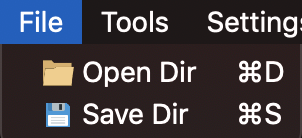
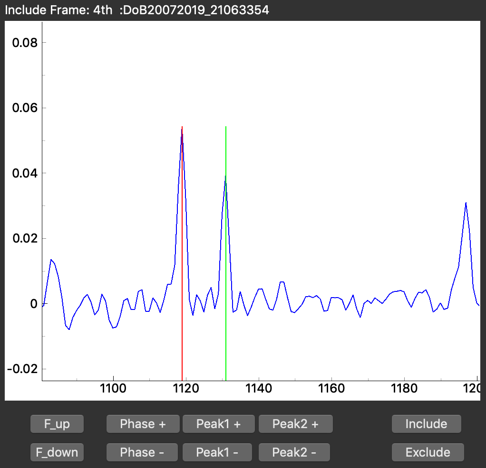
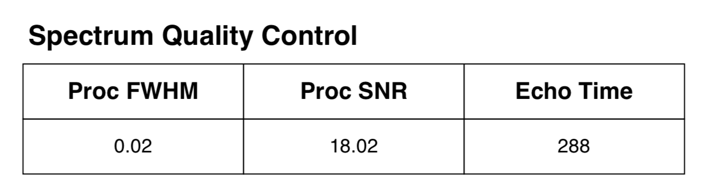
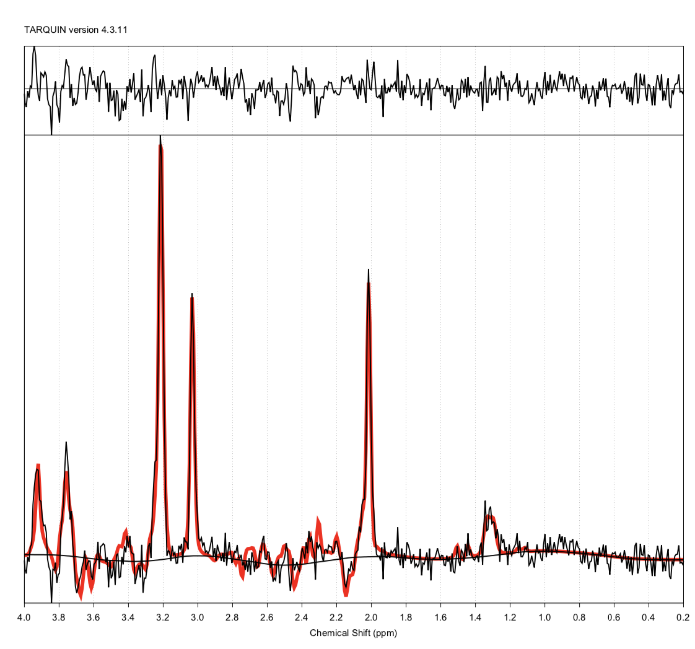

# Neonate MRS UCLH (Python3)
#### The Department of Medical Physics and Biomedical Engineering at University College London Hospitals.
This repository contains the software used to process and produce automated reports of neonatal NMR spectra acquired at 3T MRI scanners at University College London Hospital.    


## Who is it for
This software is meant to be used by MRI Clinical Scientists. Its purpose is to assist in the processing of MRS data acquired @UCLH and to generate reports for the clinical team in a quick and robust manner. However, it does not exclude the need of MR expertise and knowledge of neonate MR spectroscopy for its correct use.  


* **This software is NOT intended as an unsupervised data processing solution.**    
* **Reports produced by this sofware must be approved by a MRI Clinical Scientist @UCLH**


# Installation
#### 1) Pre-requisites:
Before installing NeonateMRS_UCLH_Python3 package you will need [Python 3](https://www.python.org), [TARQUIN](http://tarquin.sourceforge.net/index.php) and [Git](https://git-scm.com/).  
* To check if you have the required versions of Python and TARQUIN installed, in a terminal run:    
`python3 -V`  (Python version should be <t>&ge;</t> 3.7)  
`tarquin` (TARQUIN version should be <t>&ge;</t> 4.3.10)
* If you need to install Python 3, TARQUIN or Git follow the links below:   
   - Download Python 3 from [here](https://www.python.org/downloads/) and follow the installation instructions.    
   - Download the latest binaries of TARQUIN from [here](https://sourceforge.net/projects/tarquin/files/) and add it to your PATH.   
   - Intall the latest version of Git from [here](https://git-scm.com/downloads).
    

#### 2) Installing NeonateMRS_UCLH_Python3 package:
   

* Create and activate a virtual environment (venv) where all the NeonateMRS_UCLH_Python3 dependencies will be installed (recommended).   Here, we have chosen to create a venv called '*mrs*' and to place it inside a '*venvs*' folder in our `/home` directory:  

 `python3 -m venv ~/venvs/mrs`
 
  *To activate the venv on Linux or macOS:*   
  `source ~/venvs/mrs/bin/activate`    
  *To activate the venv on Windows, using PowerShell type:*   
  `/venvs/mrs/Scripts/activate.ps1`  

   (On Windows, if you get the error message “Running Scripts Is Disabled On This System” when trying to activate the venv, [here](https://www.stanleyulili.com/powershell/solution-to-running-scripts-is-disabled-on-this-system-error-on-powershell/) is an easy solution).

* Upgrade *pip* and *setuptools* (recommended):   
  `python -m pip install --upgrade pip setuptools`   
  
* Install NeonateMRS_UCLH_Python3 module and requirements:     
  `python -m pip install git+https://github.com/papomail/NeonateMRS_UCLH_Python3.git  `   

* NeonateMRS_UCLH_Python3 is now installed! To run it, just type:   
  `mrs` 


# How to use it:
1) Launch NeonateMRS_UCLH_Python3. Remember that the environment in which it was installed needs to be activated. In our case we would type:    
   
    *On Linux or macOS:*   
    `source ~/venvs/mrs/bin/activate`   
    `mrs`   
    *On Windows:*   
    `/venvs/mrs/Scripts/activate.ps1`  
    `mrs`

     
     
2) Select *input folder* (with DICOM data) and the *output folder* (where proccesd data will be saved):    
    - From the menubar click on *File > Open Dir* to select folder with the DICOM files to analyse.  
    - From the menubar select also a folder where output of the code will be saved:   
File > Save Dir  

       

    (The actual PDF report will be saved in subfolder /Tarquin_files/Tarquin_fit/ inside the selected *output folder*).

3) Use buttons **Phase +/-** to phase the spectrum until the both Choline and Creatine resonance peaks are in pure absorption mode (both pointing up).
   
4) Use buttons **Peak1 +/-** and **Peak2 +/-** to move the red and green lines to centre of the Choline and Creatine resonance peaks, respectively.
    
5) Use buttons **F_up** and **F_down** to repeat steps 3 & 4 for all *frames*. (There are 16 *frames* in our current protocol).
   
6) If the spectrum of a particular *frame* is of bad quality (e.g. wider peaks, or lower SNR) and is considered that it would be detrimental to the quality of the final spectrum, use the **Exclude** button to avoid using the *current frame* in the analysis.  
(To reverse the process and use the **Include** button to include the *current frame* to the analysis).

     

7) Once all the *frames* are checked, on the menubar press *Tools > Convert to JMRUI and Tarquin* to initiate the spectroscopic analysis and generate the PDF report.
   
     

8) Open and review the PDF report (in subfolder /Tarquin_files/Tarquin_fit/).  
Check that the **peaks are well fitted**, the **echo time is 288 ms** and that there is **nothing suspiciously odd** with the data.
   
       <br/><br/>   
       

 

# Documentation:
A description of the Class definitions and Methods used in this code is available in the [Documentation.md](Doc/Documentation.md) file inside the ```/Doc``` folder of this repository.


